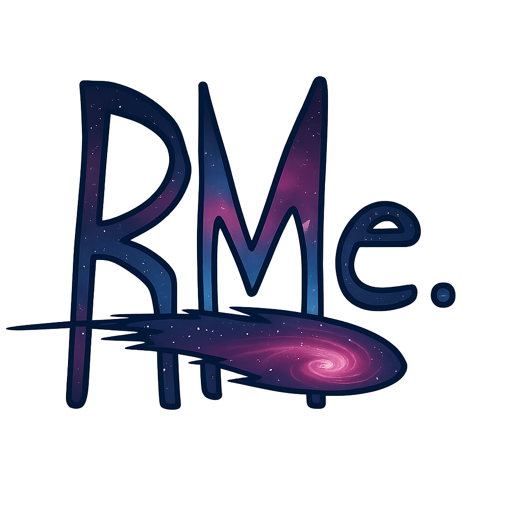

<div align="center">
  
  <h1>🚀 ReckonMe!</h1>
  <p><strong>The ultimate real-time multiplayer web party game. Guess your friends' answers and climb the leaderboard!</strong></p>

  <!-- Badges -->
  <a href="https://reactjs.org/"></a>
  <a href="https://nodejs.org/"></a>
  <a href="https://socket.io/"></a>
  <a href="https://tailwindcss.com/"></a>
</div>

<br />

## 📖 Table of Contents
- [About the Project](#-about-the-project)
- [✨ Progress Achieved (Current State)](#-progress-achieved-current-state)
- [🛠️ Tech Stack](#️-tech-stack)
- [🚀 Upcoming Roadmap](#-upcoming-roadmap)
- [🏗️ Architecture Overview](#️-architecture-overview)
- [💻 Getting Started](#-getting-started)
- [🤝 Contributing](#-contributing)
- [📝 License](#-license)

---

## 🎮 About the Project

**ReckonMe!** is a real-time, interactive party game where players jump into a room, answer eccentric questions, and most importantly—*guess what their friends answered!*

Inspired by popular social deduction and trivia games, ReckonMe! adds a unique spin with **custom question banks**, a **neo-brutalist space theme**, and an ultra-dynamic user interface designed to "wow" players at first glance. 

**Core Game Loop:**
1. Join a room via a 5-character code.
2. Select your honest answer to a question privately.
3. Guess what everyone else chose.
4. Rack up points for correct guesses.
5. Win the game and bask in the animated confetti!

---

## ✨ Progress Achieved (Current State)

We have heavily focused on creating a premium, production-ready UI/UX prototype with robust underlying real-time networking.

### UI/UX Polish & Refinements
- **Premium Aesthetics:** Hand-drawn SVGs and sketchy borders mixed with a deep-space background.
- **Micro-Animations:** Heavy use of Framer Motion for wobble effects, layout transitions, and interactive floating UI panels.
- **Dynamic Lobbies:** Seamless lobby experience where players can configure avatars, set custom question banks, and utilize real-time **SmartChat**.
- **Admin Dashboard:** Secure administrative view to monitor matches, players, and question books.
- **Profile & Match History:** Comprehensive tracking of past games, leaderboards, and user statistics.
- **Bulk Upload & Question Books:** Custom question managers allowing users to import CSV/JSON question packs dynamically.

### Core Mechanics Complete
- **Real-time Engine:** Full implementation of `Socket.io` event handling for rooms, chat, and game flow.
- **Session Management:** Robust reconnects and room state handling.
- **Turn-based State Machine:** Fully functional Lobby → Input Phase → Revealing Phase mechanics.
- **Procedural Avatars:** Integration with DiceBear (Croodles) for instant, fun avatars.

---

## 🛠️ Tech Stack

| Domain | Technology |
|---|---|
| **Frontend Framework** | React 18, Vite |
| **Styling & UI** | Tailwind CSS, Neo-Brutalist Design System |
| **Animations** | Framer Motion, Lottie-React, Magic UI |
| **State Management** | Zustand (persisted) |
| **Backend & API** | Node.js, Express.js |
| **Real-time Comms** | Socket.io |
| **Database** | MongoDB (Mongoose) |

---

## 🚀 Upcoming Roadmap

ReckonMe! is continuously evolving. Here is our strategic roadmap for transitioning from a solid prototype to a globally scalable product:

### 1. Backend Refactor & Scaling (Redis)
- Set up a managed Redis instance to handle room state across multi-server deployments.
- Implement `@socket.io/redis-adapter` to ensure high availability for up to 10k concurrent players.

### 2. Gameplay Expansion & Content Pipeline
- Implement scoring logic (points per correct guess, speed bonuses).
- Finalize the game results screen with a "Spotify Wrapped" style shareable scorecard.
- Finalize the Question Seeder script to ingest millions of initial questions.

### 3. Load Testing & Infrastructure
- Stress test the WebSockets using Artillery or k6.
- Dockerize client and server components.
- Auto-scaling deployment (AWS ECS/EKS) with load balancing and strict rate limiting.

### 4. Post-Launch Polish
- Integrate Howler.js for SFX and background music.
- Add comprehensive telemetry and analytics (PostHog/Google Analytics).
- i18n Localization for international audiences.

---

## 🏗️ Architecture Overview

The app follows a modern decoupled architecture:

```text
┌─────────────────────────────────────────────────────────────┐
│                      CLIENT (React/Vite)                    │
│  Landing ─→ Lobby ─→ Game ─→ Results                        │
│  State: Zustand (roomStore, gameStore, userStore)           │
└──────────────────────┬──────────────────────────────────────┘
                       │ WebSocket + HTTP
┌──────────────────────┴──────────────────────────────────────┐
│                     SERVER (Node/Express)                   │
│  Routes: /api/room, /api/auth, /api/history                 │
│  Socket: roomHandlers, gameHandlers, chatHandlers           │
│  Storage: MongoDB (Data) & Redis (Session/State mapping)    │
└──────────────────────────────────────────────────────────────┘
```

---

## 💻 Getting Started

Want to run ReckonMe! locally? Follow these steps:

### Prerequisites
- Node.js (v16+)
- MongoDB instance (local or Atlas)

### Installation

1. **Clone the repository:**
   ```bash
   git clone https://github.com/Sujal-0/ReckonMe..git
   cd ReckonMe!
   ```

2. **Setup Server:**
   ```bash
   cd server
   npm install
   # Create a .env file with your MONGODB_URI and JWT_KEY
   npm run dev
   ```

3. **Setup Client:**
   ```bash
   cd ../client
   npm install
   npm run dev
   ```

4. **Play!**
   Open your browser to `http://localhost:5173` (or your Vite port) to start a room.

---

## 🤝 Contributing

Contributions, issues, and feature requests are welcome! Feel free to check the [issues page](https://github.com/Sujal-0/ReckonMe./issues).

## 📝 License

This project is open-source and available under the [MIT License](LICENSE).
